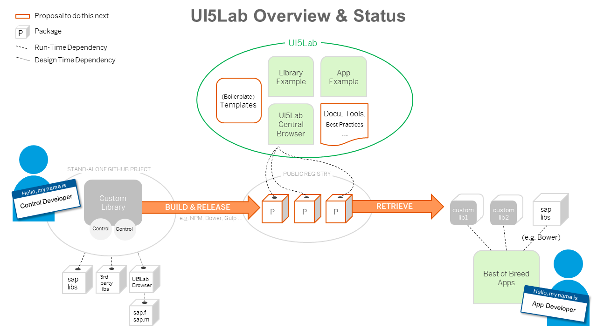

# Contributions Welcome!

You can contribute in many different ways and in all areas of the project.
Read this essential information to find out what and where to contribute.

The project is organized in [Slack Channel #UI5Lab](https://openui5.slack.com/messages/UI5lab). If you are interested in what we do, join with this [invitation link for Slack](http://slackui5invite.herokuapp.com/).

# What to contribute?

*High-level overview and current status of the UI5Lab ecosystem*

## Contribute Controls to UI5Lab

Transform your controls into a UI5Lab library as described in [this guide](https://github.com/UI5Lab/UI5Lab-central/blob/master/docs/ContributeLibrary.md) and take a look at the [UI5Lab-library-simple](https://github.com/UI5Lab/UI5Lab-library-simple) project
The custom code should be developed and maintained in individual github repositories maintained by the owner of the code for maximum flexibility, you are welcome to suggest your code project as a pilot for UI5lab. We have created the following prototype examples under this organisation as a prototype:

  * An example library of custom controls (set up according to the best practices for OpenUI5 development) can be found here:
   [UI5Lab-library-simple](https://github.com/openui5/UI5Lab-library-simple)
  * If you are new to UI5 custom control development you might want to have a look at a very basic control example without any infrastructure files first:
   [UI5Lab-control-simple](https://github.com/openui5/UI5Lab-control-simple)
  * A very basic app (using the OpenUI5 CDN) with basic consumption of the UI5Lab.geometry library can be found here:
   [ui5lab-app-simple](https://github.com/openui5/UI5Lab-app-simple)
  * A more sophisticated demo app (with a node and grunt envirnment and openui5 tooling) is available here:
   [openui5-sample-app](https://github.com/sap/openui5-sample-app)

## Contribute to UI5Lab Infrastructure

In this repository we would like to provide infrastructure for discovering and showcasing a compendium of all individual UI5Lab projects. The idea is to easily find documentation and samples for all the projects and to have them listed in a central place

  * A build infrastructure could retrieve the content based on metadata on a regular basis and list it here in a central sample browser
  * The tools to load and display many different custom artifacts from individual code packages are not existing yet for this project. This is where our next steps will happen together.
  * A public homepage showcasing and featuring all projects that are made available for UI5Lab is work in progress, we have registered the domains ui5lab.io and ui5lab.com
  * Feel free to contribute to all of the example projects under this organisation to make them more robust and flexible.
  * Templates to kick-start library and app development could be added as new repositories under this organisation

## Define Best Practices

An app that wants to consume UI5Lab artifacts needs guidelines, templates, and best practices to integrate the individual pieces of work into their existing codebase.
Make the creation and consumption of custom artifacts for UI5Lab easier by providing examples or documentation, either here in the documentation or in your own repository:

  * **Naming Conventions, Best Practices, Metadata:** help us defining a common standard for this project and documenting it publicly
  * **Guides and Documentation:** The overall setup and the infrastructure should be well-described, the [documentation](https://github.com/UI5Lab/UI5Lab-central/blob/master/docs) of this repository could be used for it
  * **Tools and Technologies:** Bring in your ideas for tools and supported technologies, this is an open project that should support common technologies like npm, webpack, ...
  * **Discuss:** Try out what we have so far and share your opinion what needs to be done next, we are curious for your ideas and your feedback

# How to Contribute?
There are two boards on Trello to coordinate our common work and define tasks: the [prototype board](https://trello.com/b/gFQs9ARW/prototype) and the [orga board](https://trello.com/b/v8thvLem/orga). Everyone can create tasks in one of the boards and update them as progress takes place. To get write access, post a request on slack to one of the admins, then join the board (button on the left panel in one of the boards).

For contributing technically on GitHub, this is how to proceed:

1. Share your idea on slack chat.
2. Fork one of the UI5Lab repositories.  
3. Create a new "pull" request to get it merged.
